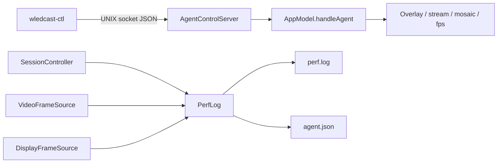

# Agent Control & Performance

Headless control of a running WledCast instance and structured performance telemetry for automation and profiling.

## Overview



While the app runs, `AgentControlServer` listens on a UNIX domain socket. `wledcast-ctl` sends newline-delimited JSON requests and receives JSON responses. In parallel, `PerfLog` writes rolling metrics to `perf.log` and refreshes `agent.json` for snapshot reads.

---

## Log Paths (`LogPaths.swift`)

Directory resolution order:

1. `$WLEDCAST_LOG_DIR` (created if missing)
2. `{repo root}/logs/` when `Package.swift` or `.git` is found upward from cwd or bundle
3. `~/Library/Logs/WledCast/`

| File | Purpose |
|------|---------|
| `wledcast.log` | Structured app log (`FileLog`) |
| `perf.log` | ISO8601 key=value perf events |
| `agent.json` | Latest metrics snapshot for agents |
| `control.sock` | Agent control UNIX socket |

Override the whole directory with:

```shell
export WLEDCAST_LOG_DIR=/tmp/wledcast-logs
```

---

## Agent Control Protocol

**Socket:** `LogPaths.controlSocket` (default `{log dir}/control.sock`)

**Wire format:** one JSON object per line (newline-terminated), request and response.

### Request

```json
{"cmd":"status"}
{"cmd":"overlay.show"}
{"cmd":"fps.set","value":30}
```

### Response

```json
{"ok":true,"data":{"streaming":"1","host":"wled.local",...}}
{"ok":false,"error":"cannot start stream"}
```

10s handler timeout per connection.

### Commands

| Command | Effect |
|---------|--------|
| `status` | Return session + path metadata |
| `overlay.show` | Show overlay window |
| `overlay.hide` | Hide overlay, stop video preview |
| `mosaic.on` / `mosaic.off` | Toggle processed mosaic preview |
| `stream.start` | Start streaming if `canStartStreaming` |
| `stream.stop` | Stop streaming |
| `fps.set` | Set `targetFps`, apply effective FPS, persist |

`status` data includes: `streaming`, `sender`, `mode`, `output`, `target_fps`, `host`, `mosaic`, `overlay_visible`, `control_socket`, `agent_json`, plus mode-specific `capture_box` or `video`.

Server starts in `AppModel.init()`. Socket file removed on stop.

---

## CLI: `wledcast-ctl`

Build target: `wledcast-ctl` (`Sources/WledCastCtl/main.swift`)

```shell
swift build
.build/debug/wledcast-ctl status
.build/debug/wledcast-ctl overlay show|hide
.build/debug/wledcast-ctl mosaic on|off
.build/debug/wledcast-ctl stream start|stop
.build/debug/wledcast-ctl fps 30
.build/debug/wledcast-ctl perf          # print agent.json (no socket)
.build/debug/wledcast-ctl wait 2        # sleep (for profiling scripts)
```

Exit 0 on `ok: true`, 1 on failure. `perf` reads `agent.json` directly (works without a live socket).

---

## Performance Logging (`PerfLog.swift`)

### Event log (`perf.log`)

Line format: `{ISO8601} key=value ...`

| Event | When |
|-------|------|
| `stream_start` | `startStreaming()` succeeds |
| `stream_stop` | `stopStreaming()` while streaming |
| `window` | Every ~2s while frames flow |

`window` fields: `mode`, `target_fps`, `fps`, `frames`, `output`, `src`, `process_avg_ms`, `process_max_ms`, `preview_frames`, `hud_preview_frames`, plus capture fields in region mode (`capture`, `source_rect`, `capture_fps`, `oversample_x/y`).

### Snapshot (`agent.json`)

Written every ~2s and on session changes. Structure:

```json
{
  "updatedAt": "...",
  "perfLog": "/path/to/perf.log",
  "fileLog": "/path/to/wledcast.log",
  "session": { "active": true, "mode": "region", ... },
  "latestWindow": { "fps": 28.1, "processAvgMs": 0.8, ... },
  "recentWindows": [ ... ],
  "hint": "pipeline_ok_check_subsystems"
}
```

Hints classify bottlenecks: `idle`, `streaming`, `pipeline_hot`, `preview_overhead`, `screencapture_likely`, `decode_or_audio_likely`, `pipeline_ok_check_subsystems`, `mixed`.

### Instrumentation points

| Source | Calls |
|--------|-------|
| `SessionController.process` | `recordFrame` (process ms, preview flag) |
| `DisplayFrameSource` | `noteCapture` (region oversample) |
| `VideoFrameSource` | `noteCapture` (decode dimensions) |
| `AppModel` video preview | `recordHudPreview` |
| `AppModel` stream lifecycle | `configure`, `event`, `syncSession` |

Preview frame counts increment when mosaic or HUD preview paths actually emit (gated by `PreviewGate`).

---

## Helper Scripts

### `Scripts/perf_read.sh`

Prints `agent.json` (repo or Library fallback) and tails last 15 lines of `perf.log`.

### `Scripts/agent_profile.sh`

Automated A/B profile: baseline CPU + agent snapshot, then overlay hide vs show (when control socket responds). Writes `logs/profile_report.json`.

Env: `WINDOW_SEC` (default 4). Requires `jq`, running WledCast, and built `wledcast-ctl`.
