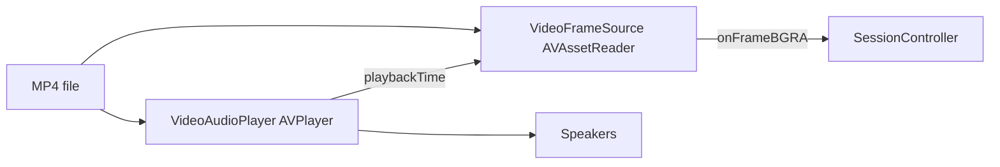

# Audio Pipeline

Audio is video-mode only. It plays locally through speakers and drives video frame timing. No audio is sent to WLED.

## Overview



## Component: `VideoAudioPlayer`

File: `Sources/WledCore/Capture/VideoAudioPlayer.swift`

### Construction

```
AVAsset(url) → duration
AVPlayerItem(asset) + audioTimePitchAlgorithm = .timeDomain
AVPlayer(item)
  volume, muted state
  applyRate(sourceFps, outputFps)
  applyPlaybackLimits()     ← forwardPlaybackEndTime = range end when loop off; .invalid when loop on
  installObservers()
  installTimeObserver()     ← 30 Hz periodic, caches playbackTime
  seekToRangeStart() → play or pause (if muted)
```

### Playback Rate

```swift
static func playbackRate(sourceFps: Float, outputFps: Int) -> Float {
    guard outputFps < sourceFps else { return 1 }
    return Float(outputFps) / sourceFps
}
```

When WLED runs at 30 fps and source video is 60 fps, both audio and video play at 0.5× so frames stay aligned with LED updates.

### Time Observation

```
addPeriodicTimeObserver(interval: 1/30s, queue: .main)
  → cachedPlaybackTime = player.currentTime
  → if loop && time >= rangeEnd → handleReachedEnd()
```

`playbackTime` is read by `VideoFrameSource` via the `playbackClock` closure.

### Loop Handling

When `loop` is on: boundary observer at range end, periodic-time check near range end, and `AVPlayerItemDidPlayToEndTime` all call `handleReachedEnd()` → seek to `loopRange.start` → resume at `playbackRate`.

When `loop` is off: `forwardPlaybackEndTime` is set to the range end; reaching the end pauses playback.

### Volume and Mute

| Method | Effect |
|--------|--------|
| `setVolume(0...1)` | `player.volume` |
| `setMuted(true)` | `player.isMuted`, pause |
| `setMuted(false)` | unmute, set rate, play |
| `pauseForScrub()` | pause during loop range UI scrub |
| `pauseForMute()` | pause when AppModel mutes during stream |
| `syncTo(time:)` | seek audio to match video after unmute |

## Sync Contract (AppModel)

### Stream Start

```
VideoAudioPlayer(url, loop, loopRange, volume, muted, sourceFps, outputFps)
VideoFrameSource(..., playbackClock: { audioPlayer?.playbackTime ?? .zero })
```

Audio starts first; video frames track audio clock.

### Mute During Stream

```
setAudioMuted(true):
  time = audioPlayer.playbackTime
  videoSource.beginMutedPlayback(at: time)   ← wall-clock from anchor
  audioPlayer.pauseForMute()

setAudioMuted(false):
  time = videoSource.currentMediaTime
  videoSource.endMutedPlayback()
  videoSource.seekMediaTime(time)
  audioPlayer.syncTo(time:)
```

While muted, video uses wall-clock elapsed time instead of audio clock.

### FPS Change

```
applyEffectiveFps(next):
  rate = VideoAudioPlayer.playbackRate(sourceFps, outputFps: next)
  videoSource.setPlaybackRate(rate)
  audioPlayer.updateOutputFps(next, sourceFps:)
  videoSource.setOutputFps(next)
```

### Loop Range Change

```
commitLoopRange(range):
  videoSource.updateLoopRange(clamped)
  audioPlayer.updateLoopRange(clamped)   ← seeks to range start, reinstalls observers
```

### Loop Scrub (UI)

```
beginLoopScrub():
  videoPreviewSource.stop()     (always)
  audioPlayer.pauseForScrub()   (if streaming)
  videoSource.stop()            (if not streaming; usually nil)
  AVAssetImageGenerator for thumbnail preview

commitLoopRange():
  resume video/audio with new range
```

## VideoFrameSource Clock Resolution

`currentMediaTimeOnQueue()` priority:

1. **Muted playback** — `wallClockAnchor.media + rate × elapsed`
2. **playbackClock set** — `playbackClock()` with jump detection (forces reader reset if clock jumps backward >150ms)
3. **Wall clock fallback** — `rangeStart + rate × elapsed` since reader start
4. **Loop wrap** — time clamped/wrapped within `LoopRange`

Reader reset triggered when target time moves backward relative to held sample or last target.

## Persistence

| Key | Type | Default |
|-----|------|---------|
| `audioVolume` | Double | 1.0 |
| `audioMuted` | Bool | false |

Applied on next `VideoAudioPlayer` creation during `startStreaming()`.

## What Audio Does Not Do

- No audio analysis or visualization
- No audio over network
- No audio in region capture mode
- Preview-only `VideoFrameSource` has no `playbackClock` and no audio player
