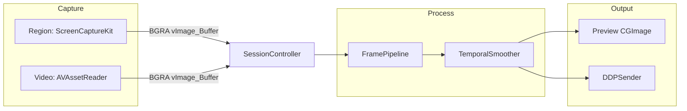

# Frame Pipeline

Every pixel path from source to WLED, end to end.

## Overview



## Path 1: Region Capture

### Source: `DisplayFrameSource` (`CaptureEngine.swift`)

```
SCShareableContent.current
  → buildFilter(display, excludingWindows: [overlay.captureWindowID])
  → SCStream(filter, configuration)
  → StreamOutput.didOutputSampleBuffer
  → CVPixelBuffer (32BGRA)
  → vImage_Buffer
  → onFrameBGRA?(buffer)
```

### Configuration

| Setting | Value |
|---------|-------|
| `pixelFormat` | `kCVPixelFormatType_32BGRA` |
| `minimumFrameInterval` | `1/fps` |
| `sourceRect` | `CaptureBox` in screen coordinates |
| `width/height` | Oversampled capture size (see below) |
| `showsCursor` | false |
| `queueDepth` | 3 |

### Oversampling

Capture resolution is oversampled relative to WLED output, then downscaled in `FramePipeline`:

```
pickOversample: 2×, 3×, 4×, 6×, or 8× (capped by source pixels)
captureWidth  = min(sourceWidth,  outputWidth  × oversample)
captureHeight = min(sourceHeight, outputHeight × oversample)
```

Backing scale from `NSScreen.backingScaleFactor` (default 2.0) applied to capture box dimensions.

### Live Region Update

When user drags/resizes capture box on same display:

```
overlay.onChange → AppModel.captureBox = box
  → source.updateRegion(box:)
    → stream.updateConfiguration(sourceRect, width, height)
```

Display change triggers full stream restart via `restartStreaming()`.

### Wiring (AppModel)

```
startScreenCaptureStream()
  CaptureBoxRef(captureBox)           ← thread-safe box for stream
  DisplayFrameSource(boxRef, resolution, fps, selection, excludedWindows)
  frameSource.onFrameBGRA → session.process(bgra:)
```

---

## Path 2: Video Capture

### Source: `VideoFrameSource` (`VideoFrameSource.swift`)

```
AVAsset → AVAssetTrack (video)
  → AVAssetReader + AVAssetReaderTrackOutput (32BGRA)
  → DispatchSourceTimer at outputFps
  → sampleForCurrentTime() selects nearest frame to playback clock
  → normalizedCrop() applied to pixel buffer
  → vImage_Buffer (cropped BGRA)
  → onFrameBGRA?(buffer)
  → onPreviewBuffer?(pixelBuffer)   ← overlay preview
```

### Playback Clock

| State | Clock source |
|-------|--------------|
| Streaming, audio on | `playbackClock()` → `VideoAudioPlayer.playbackTime` |
| Streaming, muted | Wall-clock anchor from mute time |
| Preview only | Internal wall-clock from reader start |
| Loop enabled | Time wrapped within `LoopRange` |

### Playback Rate

When WLED FPS < source FPS:

```
playbackRate = outputFps / sourceFps   (capped at 1.0)
```

Applied to both `VideoFrameSource` and `VideoAudioPlayer` so video slows to match LED frame rate.

### Decode Size

```
decodeTarget = WLED outputResolution (optional)
desired = clamp(64, ledMax × 4, 720) on long edge
```

Reader output settings include width/height when downscaling from source.

### Loop Range

```
LoopRange { start, end }   // normalized 0–1, min span 0.01
reader.timeRange = [start × duration, end × duration]
```

Reader restarts at range boundaries. Loop scrub uses `AVAssetImageGenerator` for thumbnails.

### Wiring (AppModel)

```
startStreaming() video branch:
  VideoAudioPlayer(url, loop, loopRange, volume, muted, sourceFps, outputFps)
  VideoFrameSource(url, fps, crop, loop, loopRange, decodeTarget, playbackClock)
  videoSource.shouldEmitPreview → videoPreviewGate + overlay visible
  videoSource.onFrameBGRA → session.process(bgra:)
  videoSource.onPreviewBuffer → overlay.setPreviewBuffer (when not scrubbing)
```

Preview-only path (not streaming, overlay visible):

```
videoPreviewSource = VideoFrameSource(...)   // no playbackClock
videoPreviewSource.shouldEmitPreview → videoPreviewGate
videoPreviewSource.onPreviewBuffer → overlay.setPreviewBuffer
```

---

## Path 3: Processing

### `SessionController.process(bgra:)`

```
1. Read filterConfig + flickerFighter (under lock)
2. preview = shouldProcessPreview?() == true
3. pipeline.process(bgra:, filters:, rgbOut:) → workPixels
4. temporalSmoother.apply(pixels:, strength:) → workPixels
5. PerfLog.recordFrame(processMs, preview flag)
6. onFrameProcessed?(pixels) [only if preview] → AppModel.updatePreview
7. sender.send(pixels:) → DDPSender
```

Filter updates (`updateFilters`, `updateFlickerFighter`) apply on next frame without restart. DDP send is unconditional; mosaic preview is gated.

### `FramePipeline.process(bgra:, filters:)`

| Step | Operation |
|------|-----------|
| 1. Scale | `vImageScale_ARGB8888` — aspect-fill to output resolution |
| 2. Convert | `vImageConvert_BGRA8888toRGB888` |
| 3. Color | Saturation matrix + contrast/brightness + per-channel balance |
| 4. Sharpen | Optional 3×3 kernel when `filters.sharpen != 0` |

Output: `RGBFrame(width, height, pixels[w×h×3])`

Default filters (`FilterConfig.default`):

```
sharpen: 0.1, saturation: 1.0, brightness: 0.3, contrast: 1.0
balanceR: 1.0, balanceG: 0.7, balanceB: 0.45
```

### `TemporalSmoother.apply(pixels:, strength:)`

Flicker fighter (strength 0–1), operates in-place on RGB pixel buffer:

```
deadband = strength² × 24
alpha = 1 - strength
Per pixel: if |delta| ≤ deadband → keep previous; else blend
```

Strength 0 passes frame through unchanged (still updates previous buffer).

---

## Path 4: Transport

### `DDPSender.send(pixels:)`

```
workPixels [UInt8] (w×h×3)
  → sendRaw(Data)
  → DDPPacketizer.packets(for:)
  → NWConnection.send (UDP, one send per packet)
```

Also accepts `send(frame: RGBFrame)` as a convenience wrapper.

### Blackout

```
session.blackout()
  → sender.sendBlackout(pixelCount: w×h)
  → Data(repeating: 0, count: pixelCount × 3)
```

Sent on `stopStreaming()` before tearing down capture.

See [Network](network.md) for DDP packet format.

---

## Path 5: Preview (UI feedback)

Preview paths are throttled by `PreviewGate` (one emit per `1/fps` interval) and disabled when the overlay is hidden. Neither affects WLED output timing.

### Mosaic preview (processed output)

```
SessionController.onFrameProcessed [if shouldProcessPreview]
  → AppModel.updatePreview(pixels)
  → makePreviewCGImage (24-bit RGB)
  → overlay.mosaicHolder.set(image)
```

Gated by `mosaicPreviewGate`: enabled when mosaic toggle on and overlay visible.

### Video preview (raw decode)

```
VideoFrameSource.onPreviewBuffer [if shouldEmitPreview]
  → PerfLog.recordHudPreview
  → OverlayWindowController.setPreviewBuffer(CVPixelBuffer)
  → CIContext → NSImage in overlay HUD
```

Gated by `videoPreviewGate`: enabled when overlay visible.

Used in video mode (streaming or preview-only). Processed mosaic preview is region-mode only; video mode shows raw decode preview in the HUD.

---

## Frame Rate Chain

```
WLED cfg.json hw.led.fps (or default 42)
  → WLEDHost.targetFps / effectiveFps
  → AppModel.fps
  → DisplayFrameSource.fps (SCStream minimumFrameInterval)
  → VideoFrameSource.outputFps (DispatchSourceTimer interval)
  → VideoAudioPlayer.playbackRate (when sourceFps > outputFps)
```

FPS change while streaming triggers `restartStreaming()`.
