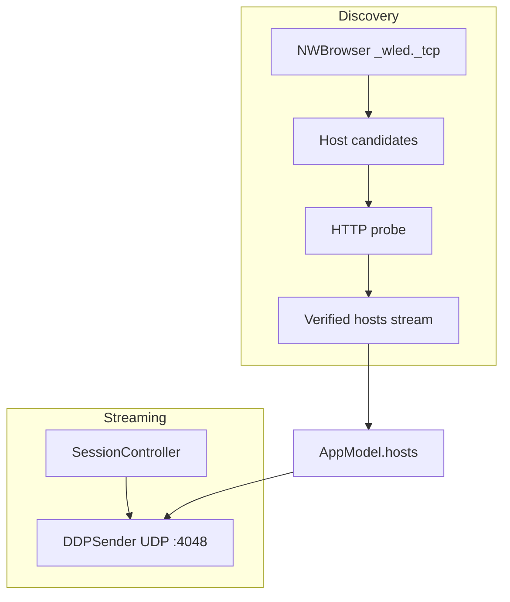

# Network

Discovery, WLED HTTP probing, and DDP pixel transport.

## Overview



WLED receives pixel data over DDP only. No JSON state API is used for frames.

---

## Bonjour Discovery

**Component:** `WLEDDiscoveryClient` (actor)

**File:** `Sources/WledCore/Discovery/WLEDDiscoveryClient.swift`

### Browser

```
NWBrowser(for: .bonjour(type: "_wled._tcp", domain: "local"), using: .tcp)
browseResultsChangedHandler → ingest(results:)
```

### Candidate Extraction

| Endpoint type | Host string |
|---------------|-------------|
| `.service(name, domain: "local")` | `{name}.local` |
| `.hostPort(host, port)` | host debug description |

Deduplicated in `hostCandidates` set.

### Verification

Each new candidate probed concurrently:

```
GET http://{host}/json/info     → matrix resolution
GET http://{host}/cfg.json      → target FPS (fallback /json/cfg)
```

Success → stored in `verifiedHosts[host] = WLEDHostProfile`
Failure → candidate dropped (logged)

### Host Stream

```swift
func hostStream() -> AsyncStream<[WLEDHost]>
```

Yields sorted snapshot on subscribe and after each probe batch.

AppModel consumes:

```swift
for await discovered in stream {
    self.hosts = discovered
    // select host, apply profile, reconcile
}
```

### Direct Operations

| Method | Purpose |
|--------|---------|
| `fetchHostProfile(host:)` | HTTP probe without Bonjour (saved host reconciliation) |
| `verify(host:)` | Force-probe a manually saved host |
| `inject(host:profile:)` | Insert verified host after direct probe |
| `discoverHosts(timeout:)` | Blocking discovery with timeout (unused in app) |

---

## WLED HTTP Parsing

**File:** `Sources/WledCore/Discovery/WLEDInfo.swift`

### Info Parser

```swift
WLEDInfoParser.matrixResolution(from: Data) throws -> OutputResolution
```

Requires `leds.matrix.w` and `leds.matrix.h` > 0.

Throws `WLEDInfoError.notAMatrix` for strip/non-matrix devices.

### Config Parser

```swift
WLEDCfgParser.parseTargetFps(from: Data) -> Int?
WLEDCfgParser.resolveTargetFps(infoData:cfgData:) -> Int
```

Resolution order:

1. `cfg.json` → `hw.led.fps`
2. `WLEDHost.defaultFps` (42)

Info `leds.fps` is parsed by `measuredFps` but not used for target selection.

FPS values accept Int, Double, NSNumber, or String.

Test fixtures: `Tests/WledCoreTests/Fixtures/wled_info_fixtures.json`

---

## DDP Transport

**Files:** `DDPSender.swift`, `DDPPacketizer.swift`

### Connection

```
NWConnection(host: NWEndpoint.Host, port: 4048, using: .udp)
queue: wledcast.ddp.sender
stateUpdateHandler → DDPSenderState
```

### Send Path

```
send(pixels: [UInt8])  // primary path from SessionController
send(frame: RGBFrame)  // convenience wrapper
  → sendRaw(Data)
    → packetizer.packets(for: data)
    → for each packet: connection.send(content:)
```

All sends serialized on sender queue.

### Reconnect

On `.failed` or `.cancelled` (while connection non-nil):

```
scheduleReconnect() → 1.2s delay → connect()
```

While disconnected, `sendRaw` schedules reconnect but drops current frame.

### Stop

```
stop() → cancel reconnect, cancel connection, state = .stopped
```

No reconnect after explicit stop.

### Blackout

```
sendBlackout(pixelCount:)
  → Data(repeating: 0, count: pixelCount × 3)
  → same packetization as normal frame
```

---

## Host Reconciliation

When saved host disappears from Bonjour results (and at least one other host was discovered):

```
reconcileSelectedHostIfNeeded(discovered)
  guard discovered non-empty, selectedHost not in discovered
  guard savedHostReachabilityChecked == false
  savedHostReachabilityChecked = true

  1. discovery.fetchHostProfile(savedHost)
     success → inject + applyHostProfile
  2. else replacementHost(discovered):
       - single discovered host → use it
       - multiple hosts, one matching outputResolution → use it
       - else → keep saved host (no replacement)
```

---

## Saved Host Refresh

On init if `selectedHost` non-empty:

```
refreshSelectedHostProfile()   // async HTTP fetch
Task { discovery.verify(host:) → autoStart() }
```

Profile changes while streaming restart only when resolution changes and FPS is unchanged (FPS changes restart via `applyEffectiveFps`).

---

## Network Requirements

| Protocol | Port | Direction |
|----------|------|-----------|
| Bonjour/mDNS | — | multicast |
| HTTP | 80 | app → WLED |
| DDP/UDP | 4048 | app → WLED |

Entitlement: `com.apple.security.network.client`

Info.plist Bonjour services: `_wled._tcp`, `_http._tcp`

---

## Error Surfaces in UI

| Failure | UI indication |
|---------|---------------|
| DDP connect fail | `senderState = .failed(message)`, status line |
| No video selected | `senderState = .failed("No video selected")` |
| Screen permission denied | Alert + System Settings link |
| YouTube fetch fail | `fetchState = .failed(message)` |
| No verified hosts | "No verified hosts" in pickers |

WLED HTTP probe failures are logged (`Log.discovery`) but do not surface alerts; hosts simply don't appear in list.
